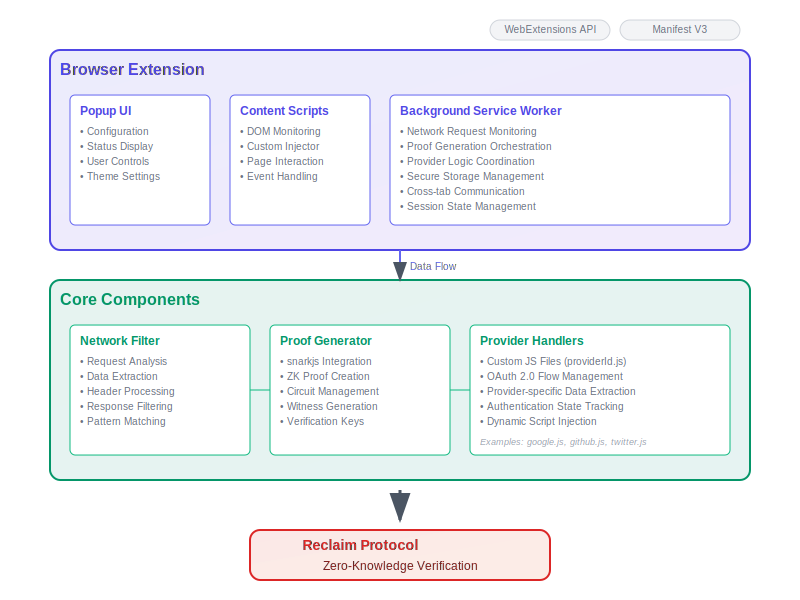

# Reclaim Browser Extension Template

A comprehensive browser extension template built for the Reclaim Protocol ecosystem. This template provides a solid foundation for developers to create custom browser extensions that generate zero-knowledge proofs from web activity, enabling privacy-preserving credential verification.

## 🎯 Purpose

This project serves as a **template and SDK** for developers who want to build browser extensions that integrate with the Reclaim Protocol. Rather than starting from scratch, you can fork this template, customize it for your specific use case, and add additional features on top of the robust foundation we've provided.

## 🏗️ Architecture Overview



The extension follows a modular architecture with three main layers:

**Browser Extension Layer:**
- **Popup UI**: Configuration interface, status display, and user controls
- **Content Scripts**: DOM monitoring, custom script injection, and page interaction  
- **Background Service Worker**: Network monitoring, proof orchestration, and state management

**Core Components Layer:**
- **Network Filter**: Analyzes requests, extracts data, and processes responses
- **Proof Generator**: Integrates with snarkjs for zero-knowledge proof creation
- **Provider Handlers**: Custom JavaScript files (providerId.js) for provider-specific logic

**Integration:**
- All components work together to generate cryptographic proofs that are verified by the Reclaim Protocol without exposing the underlying user data.

## 🚀 Quick Start

### Prerequisites
- Node.js 16+ 
- npm or yarn
- Modern browser (Chrome/Firefox/Edge)

### Installation & Setup

1. **Clone the template**:
   ```bash
   git clone https://github.com/your-org/reclaim-extension-template.git
   cd reclaim-extension-template
   ```

2. **Install dependencies**:
   ```bash
   npm install
   ```

3. **Development mode** (with hot reload):
   ```bash
   npm run dev
   ```

4. **Production build**:
   ```bash
   npm run build
   ```

5. **Load in browser**:
   - **Chrome**: Navigate to `chrome://extensions/` → Enable Developer Mode → Load Unpacked → Select `build/` folder
   - **Firefox**: Navigate to `about:debugging` → This Firefox → Load Temporary Add-on → Select any file in `build/`

## 📁 Project Structure

```
src/
├── assets/                # Icons, images, static files
│   └── img/               # Logo and other images
├── background/            # Background service worker and related logic
│   ├── background.js
│   ├── messageRouter.js
│   ├── sessionManager.js
│   ├── proofQueue.js
│   ├── tabManager.js
│   ├── cookieUtils.js
│   ├── types.js
│   └── README.md
├── content/               # Content scripts for web pages
│   ├── content.js
│   └── components/
│       └── ProviderVerificationPopup.js
├── interceptor/           # Network interception logic
│   └── network-interceptor.js
├── js-scripts/            # Custom JS scripts for injection
│   ├── sample.js
│   └── 8f8f3def-7864-4dae-890d-9e95c5e45bec.js
├── offscreen/             # Offscreen document and scripts
│   ├── offscreen.html
│   └── offscreen.js
├── utils/                 # Utility functions and helpers
│   ├── polyfills.js
│   ├── offscreen-manager.js
│   ├── session-timer.js
│   ├── fetch-calls.js
│   ├── websocket-polyfill.js
│   ├── polyfill-test.js
│   ├── offscreen-websocket.js
│   ├── logger/
│   │   ├── index.js
│   │   ├── debugLogger.js
│   │   ├── LogEntry.js
│   │   ├── LoggerService.js
│   │   ├── constants.js
│   │   └── README.md
│   ├── proof-generator/
│   │   ├── proof-generator.js
│   │   ├── proof-formatter.js
│   │   └── index.js
│   ├── constants/
│   │   ├── constants.js
│   │   ├── interfaces.js
│   │   └── index.js
│   ├── claim-creator/
│   │   ├── claim-creator.js
│   │   ├── claim-creator.test.js
│   │   ├── index.js
│   │   ├── network-filter.js
│   │   ├── params-extractor.js
│   │   ├── params-extractor-utils.js
│   │   └── replay-request.js
│   └── mocks/
│       ├── jsdom-mock.js
│       ├── koffi-mock.js
│       ├── re2-mock.js
│       └── worker-threads-mock.js
└── manifest.json          # Extension manifest
```

## 🎨 UI Customization & Styling

The extension UI is fully customizable to match your brand and requirements.

### Popup Interface Customization

**Location**: `src/popup/`

```css
/* src/popup/styles.css - Customize the popup appearance */
:root {
  --primary-color: #your-brand-color;
  --secondary-color: #your-secondary-color;
  --background: #your-background;
  --text-color: #your-text-color;
}

.popup-container {
  /* Modify dimensions, colors, layout */
  width: 400px;
  min-height: 500px;
}
```

**Key Customization Points**:
- **Colors & Branding**: Update CSS variables in `styles.css`
- **Layout**: Modify `index.html` structure
- **Interactions**: Extend `popup.js` for custom functionality
- **Animations**: Add CSS transitions and animations
- **Dark/Light Modes**: Implement theme switching

### Content Script Styling

**Location**: `src/content/`

Customize how the extension interacts with web pages:

```javascript
// src/content/index.js - Customize injected UI elements
const createOverlay = () => {
  const overlay = document.createElement('div');
  overlay.className = 'reclaim-overlay'; // Style this in your CSS
  // Add your custom styling and functionality
};
```

## 🔧 Core Components Deep Dive

### 1. Network Filter (`src/background/networkFilter.js`)

Monitors and filters network requests to extract verification data:

```javascript
class NetworkFilter {
  constructor() {
    this.activeFilters = new Map();
  }
  
  // Add custom filtering logic for your providers
  addProviderFilter(providerId, filterConfig) {
    // Implement your custom network filtering
  }
}
```

### 2. Proof Generator (`src/utils/proofGenerator.js`)

Handles zero-knowledge proof creation using snarkjs:

```javascript
class ProofGenerator {
  async generateProof(data, providerConfig) {
    // Customize proof generation logic
    // Add support for different proof systems
  }
}
```

### 3. Provider System (`src/providers/`)

Extensible provider system for different web services.

## 🔌 Custom Provider Implementation

### Creating Custom Providers with DevTool

The easiest way to add new providers is using our **[Developer Tool](https://dev.reclaimprotocol.org)** 🛠️

**Step-by-step process:**

1. **Create Your Provider**
   - Visit the [Dev Tool](https://dev.reclaimprotocol.org)
   - Design a custom provider for any website or service you want to verify
   - Configure the data extraction rules and verification parameters

2. **Set Up Your Application**
   - Create a new application in the Dev Tool
   - This generates the necessary configuration for your extension

3. **Integrate with Your Extension**
   - Use our [JavaScript SDK](https://github.com/reclaimprotocol/reclaim-js-sdk) to connect your application
   - The SDK will automatically trigger this browser extension when users need verification

**What this achieves:** Your users can seamlessly verify credentials from any web service while keeping their data private through zero-knowledge proofs.

### Custom JavaScript Injections

For providers requiring custom JavaScript execution on their pages:

1. **File Naming Convention**: `src/providers/[providerId].js`
2. **Automatic Loading**: The extension automatically loads and injects scripts based on provider ID
3. **Scope**: Injected scripts have access to the provider's page DOM and can interact with their APIs

**Example injection workflow**:
```javascript
// The extension automatically looks for and loads:
// src/providers/linkedin.js   → for LinkedIn data
// src/providers/[your-provider].js → for your custom provider
```

## 🛠️ Development Workflow

### Adding New Features

1. **Identify Extension Point**: Determine where your feature fits (background, content, popup, or provider)
2. **Extend Base Classes**: Inherit from existing components where possible
3. **Add Provider Logic**: Create custom provider files if needed
4. **Update Manifest**: Add any new permissions or resources
5. **Test Thoroughly**: Test across different browsers and scenarios

### Testing Your Extension

```bash
# Run development server
npm run dev

# Run tests (add your test framework)
npm test

# Build for production
npm run build

# Package for distribution
npm run package
```

### Browser-Specific Considerations

The template includes polyfills for Node.js modules to ensure compatibility:

- **Webpack Configuration**: `webpack.config.js` handles module resolution
- **Polyfills**: `src/utils/polyfills.js` provides browser compatibility
- **Manifest V3**: Built for modern extension standards

## 📦 Distribution & Deployment

### Extension Store Preparation

1. Update `manifest.json` with your extension details
2. Prepare store assets (icons, screenshots, descriptions)
3. Test thoroughly across target browsers
4. Submit to respective extension stores

## 🔒 Security & Privacy

- **Zero-Knowledge Proofs**: Data verification without exposure
- **Local Processing**: Sensitive operations happen locally
- **Minimal Permissions**: Only essential browser permissions requested
- **Secure Storage**: Encrypted local storage for sensitive data

## 🤝 Contributing to the Template

We welcome contributions that improve the template for all developers:

1. Fork the repository
2. Create a feature branch
3. Add comprehensive tests
4. Update documentation
5. Submit a pull request

## 📚 Resources & Documentation

- [Reclaim Protocol Documentation](https://docs.reclaimprotocol.org)
- [Browser Extension APIs](https://developer.mozilla.org/en-US/docs/Mozilla/Add-ons/WebExtensions)
- [snarkjs Documentation](https://github.com/iden3/snarkjs)

## 🆘 Support & Community

- **Issues**: [GitHub Issues](https://github.com/your-org/reclaim-extension-template/issues)
- **Discussions**: [GitHub Discussions](https://github.com/your-org/reclaim-extension-template/discussions)  
- **Documentation**: [Full Documentation Site](https://docs.reclaimprotocol.org/extensions)

## 📄 License

MIT License - see [LICENSE](LICENSE) file for details.

---

**🚀 Ready to build your privacy-preserving browser extension? Start by forking this template and customizing it for your use case!**